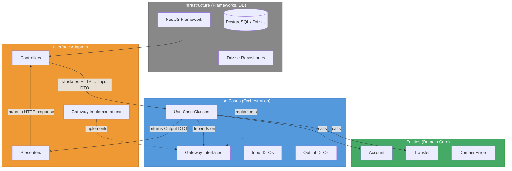

# Clean Architecture — Banking Example

One of 7 architecture comparison projects. Same banking domain (accounts + transfers), same API surface, NestJS + TypeScript + Drizzle + PostgreSQL + Vitest.

## Architecture Overview

Clean Architecture organizes code in concentric layers where dependencies **always point inward**:

```
Infrastructure  →  Interface Adapters  →  Use Cases  →  Entities
  (outermost)                                           (innermost)
```



- **Entities** — Pure domain objects with business rules. No framework imports. `Account` enforces invariants like non-negative balance and required owner; `Transfer` is a simple value holder.
- **Use Cases** — Application-specific business rules. One class per operation. Each use case takes an Input DTO, calls gateways/entities, returns an Output DTO. Defines gateway interfaces that outer layers must implement.
- **Interface Adapters** — Controllers translate HTTP requests into use case inputs. Presenters translate use case outputs into HTTP responses. The error filter maps domain errors to HTTP status codes.
- **Infrastructure** — Concrete implementations: Drizzle repositories (implementing gateway interfaces), database connection provider, NestJS module wiring, `main.ts`.

The **dependency rule**: inner layers never import from outer layers. Use cases define abstract gateway interfaces; infrastructure provides concrete implementations. NestJS DI wires them together at the module level.

## Project Structure

```
src/
├── entities/                          # Innermost layer — pure domain
│   ├── account.ts                     # Account entity (debit/credit, validation)
│   ├── transfer.ts                    # Transfer entity (data holder)
│   └── errors.ts                      # Domain error types
├── use-cases/                         # Application business rules
│   ├── gateways/                      # Abstract interfaces (ports)
│   │   ├── account.gateway.ts         # AccountGateway interface + Symbol token
│   │   ├── transfer.gateway.ts        # TransferGateway interface + Symbol token
│   │   └── unit-of-work.gateway.ts    # UnitOfWorkGateway interface + Symbol token
│   ├── create-account/                # One folder per use case
│   │   ├── create-account.input.ts    # Input DTO
│   │   ├── create-account.output.ts   # Output DTO
│   │   └── create-account.use-case.ts # Use case class
│   ├── get-account/
│   ├── get-transfer/
│   ├── initiate-transfer/
│   └── list-accounts/
├── interface-adapters/                # Controllers + presenters
│   ├── controllers/
│   │   ├── account.controller.ts      # REST endpoints for accounts
│   │   └── transfer.controller.ts     # REST endpoints for transfers
│   ├── presenters/
│   │   ├── account.presenter.ts       # Use case output → HTTP response shape
│   │   └── transfer.presenter.ts
│   └── error-filter.ts               # Maps domain error names → HTTP status codes
└── infrastructure/                    # Outermost layer — frameworks & drivers
    ├── app.module.ts                  # NestJS module — all DI wiring happens here
    ├── main.ts                        # Bootstrap
    └── persistence/drizzle/
        ├── schema.ts                  # Drizzle table definitions
        ├── drizzle.provider.ts        # DB connection factory
        ├── account-repository.ts      # Implements AccountGateway
        ├── transfer-repository.ts     # Implements TransferGateway
        ├── unit-of-work.ts            # Implements UnitOfWorkGateway (DB transactions)
        └── migrations/

test/
├── entities/account.test.ts           # Pure entity unit tests
├── use-cases/                         # Use case tests with in-memory gateways
│   ├── create-account.test.ts
│   ├── get-account.test.ts
│   ├── get-transfer.test.ts
│   ├── initiate-transfer.test.ts
│   └── list-accounts.test.ts
├── in-memory-account-gateway.ts       # Test doubles implementing gateway interfaces
├── in-memory-transfer-gateway.ts
├── in-memory-unit-of-work.ts
├── integration/                       # Full HTTP integration tests (supertest)
│   ├── accounts.integration.test.ts
│   └── transfers.integration.test.ts
└── setup.ts                           # DB migration + truncation for integration tests
```

## How It's Used

### Dependency Flow

A request flows outward-to-inward, then back:

```
HTTP Request
  → Controller (interface adapter)
    → Use Case (application layer)
      → Entity (domain logic)
      → Gateway interface (defined in use-cases/)
        → Drizzle Repository (infrastructure, injected at runtime)
    → Presenter (interface adapter)
  → HTTP Response
```

### One Class Per Use Case

Each operation is its own class with a single `execute(input): Promise<output>` method:

- `CreateAccountUseCase` — creates an Account entity, persists via gateway
- `GetAccountUseCase` — validates UUID format, fetches via gateway, maps to output
- `ListAccountsUseCase` — fetches all, maps to output
- `InitiateTransferUseCase` — validates, checks accounts exist, runs debit/credit in a unit of work transaction, persists failed transfers on `InsufficientFundsError`
- `GetTransferUseCase` — validates UUID, fetches via gateway

### Gateways (Interfaces as Ports)

Gateway interfaces live in `use-cases/gateways/` alongside Symbol tokens for NestJS DI:

```typescript
export const ACCOUNT_GATEWAY = Symbol('ACCOUNT_GATEWAY');
export interface AccountGateway {
  save(account: Account): Promise<Account>;
  findById(id: string): Promise<Account | undefined>;
  findAll(): Promise<Account[]>;
  updateBalance(id: string, newBalance: number): Promise<void>;
}
```

Use cases inject gateways via `@Inject(ACCOUNT_GATEWAY)`. The `AppModule` binds the Symbol to the concrete Drizzle implementation. Tests bind it to in-memory implementations.

### Presenters

Presenters are pure functions (not classes) that map use case output DTOs to the HTTP response shape. Controllers call them explicitly:

```typescript
const output = await this.createAccount.execute({ owner, balance });
return presentAccount(output);
```

### Unit of Work

The `UnitOfWorkGateway` interface wraps transactional operations. The use case passes a callback that receives transactional gateway instances. The Drizzle implementation runs the callback inside a `db.transaction()`, providing gateways that use the transaction handle (with `SELECT ... FOR UPDATE` for row-level locking).

### Error Handling

Domain errors are plain `Error` subclasses defined in `entities/errors.ts`. The `DomainErrorFilter` (interface adapter layer) maps error class names to HTTP status codes via a `Map<string, number>`. No HTTP concepts leak into entities or use cases.

## Key Patterns

| Pattern | Where | Purpose |
|---------|-------|---------|
| **Entity** | `entities/` | Encapsulates domain rules and invariants (e.g., `Account.debit()` checks balance) |
| **Use Case** | `use-cases/*/` | One class per operation, explicit Input/Output DTOs, orchestrates entities + gateways |
| **Gateway (Port)** | `use-cases/gateways/` | Abstract interface + Symbol token; inner layer defines the contract, outer layer implements |
| **Repository** | `infrastructure/persistence/` | Concrete gateway implementations using Drizzle ORM |
| **Presenter** | `interface-adapters/presenters/` | Pure functions mapping use case output to HTTP response format |
| **DTO** | `*.input.ts`, `*.output.ts` | Plain interfaces at use case boundaries — no entity leakage to outer layers |
| **Unit of Work** | Gateway interface + Drizzle impl | Transactional consistency for multi-step operations |
| **Error Filter** | `interface-adapters/error-filter.ts` | Translates domain error names to HTTP status codes without coupling layers |
| **Symbol-based DI** | Gateway files | NestJS injection tokens that avoid coupling to concrete classes |

## Gotchas

1. **Presenter pass-through** — In this project, presenters mostly copy fields 1:1 from use case output to response. They feel redundant until you need to rename a field, format a date, or add HATEOAS links. The boilerplate cost is real; the payoff is only visible at scale or when the API shape diverges from the domain shape.

2. **Use case output already flattens entities** — Each use case manually maps entity fields to the output DTO. This is intentional (entities must not leak out), but it means you write the same `{ id, owner, balance, status }` mapping in the use case AND again in the presenter. Two mapping steps for every property.

3. **Input validation lives in use cases, not entities** — UUID format validation happens in use cases (`GetAccountUseCase`, `InitiateTransferUseCase`), not in entities. Entity constructors validate domain invariants (non-negative balance, required owner). This split is correct by Clean Architecture rules but can be confusing — you need to check both layers to understand all validation.

4. **UnitOfWork re-implements repositories** — The `unit-of-work.ts` file contains `TransactionalAccountGateway` and `TransactionalTransferGateway` classes that duplicate the mapping logic from the standalone repositories, but operate on the transaction handle. Changes to the repository need to be mirrored in the transactional versions.

5. **Gateway interfaces live in the use-cases layer, not entities** — This is correct (use cases define what persistence operations they need), but developers used to "ports in the domain layer" patterns may look in the wrong place.

6. **NestJS decorators on use cases** — Use cases are annotated with `@Injectable()` and use `@Inject()`. This is a pragmatic concession — technically it couples the use case layer to NestJS. A stricter approach would use factory functions or manual wiring, but that adds complexity with minimal benefit in a NestJS codebase.

7. **`Transfer` entity has no business logic** — Unlike `Account` (which has `debit`/`credit` with invariant checks), `Transfer` is a plain data class. It acts more like a value object / record than a rich entity. Amount validation (`> 0`) is done in the use case, not in the `Transfer` constructor.

8. **Error filter uses string-based matching** — `DomainErrorFilter` maps `error.name` strings to HTTP status codes. If you rename an error class but forget to update the map, the error silently falls through to 500. There is no compile-time safety net for this mapping.

## Pros

- **Testability** — Use cases are tested with in-memory gateway doubles. No database, no HTTP server, no NestJS bootstrap. Entity tests are pure JS. Fast, deterministic, isolated.
- **Framework independence (in theory)** — Entities and use case logic have zero framework imports (aside from `@Injectable`). Swapping NestJS for Express or Fastify only requires rewriting controllers and the module.
- **Explicit boundaries** — The Input/Output DTOs at use case boundaries make the contract crystal clear. You can read a use case file and know exactly what goes in and what comes out without tracing through layers.
- **Dependency direction is enforceable** — Inner layers literally cannot import from outer layers because the imports would be circular. The gateway interface pattern makes this structural, not just a convention.
- **Isolated domain logic** — Business rules live in entities and are exercised independently. `Account.debit()` doesn't know about HTTP, SQL, or NestJS.
- **Swappable infrastructure** — Replacing Drizzle with Prisma, or PostgreSQL with MongoDB, means implementing the gateway interfaces. Use cases and entities are untouched.

## Cons

- **File and boilerplate explosion** — 5 use cases produce 15 files (input + output + use case each). Add gateways, presenters, repositories, and you have ~35 source files for a CRUD-with-transfers app. N-tier does this in a fraction.
- **Double mapping overhead** — Entity to use case output, then use case output to presenter response. For simple cases this is copy-paste busywork with no added value.
- **Transactional gateway duplication** — The `UnitOfWork` implementation must duplicate repository logic for transactional versions. This is a maintenance trap — changes to mapping or query logic must be applied in two places.
- **Overkill for simple operations** — `ListAccountsUseCase` is 8 lines of useful code wrapped in a class, an input type, and an output type. The architecture tax per operation is high when the operation is trivial.
- **NestJS coupling leaks in** — `@Injectable()` on use cases and `@Inject()` with Symbol tokens are NestJS-specific. The "framework-independent" benefit is diluted in practice.
- **Indirection cost** — Following a request from controller to presenter requires jumping through 4+ files. New developers need to understand the full layer model before they can make a simple change.
- **Presenter layer adds little in this project** — When the presenter just copies fields unchanged from the use case output, it is pure ceremony. It only pays for itself when API and domain shapes diverge.
