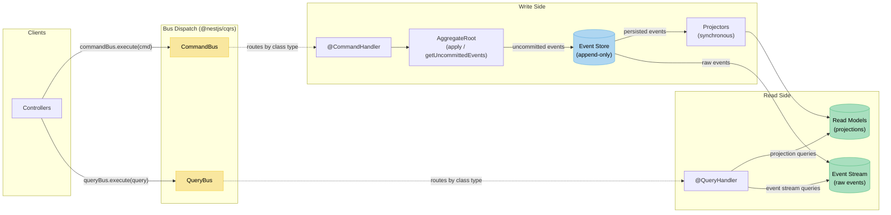

# CQRS/ES with @nestjs/cqrs

Banking domain (accounts + transfers) implemented with CQRS and Event Sourcing using the `@nestjs/cqrs` module. NestJS + TypeScript + Drizzle ORM + PostgreSQL + Vitest.

## Architecture Overview



> **Bus dispatch vs direct injection:** Controllers never inject handlers directly. They inject `CommandBus` / `QueryBus` and dispatch plain command/query objects. The bus matches the object's class type to the handler decorated with `@CommandHandler(CommandClass)` or `@QueryHandler(QueryClass)`. This decouples controllers from handler implementations -- adding a new command means adding a handler class with a decorator, not updating a routing map or changing controller imports.

This project uses `@nestjs/cqrs` to provide the CQRS infrastructure that the hand-rolled `cqrs-es/` project builds from scratch:

- **CommandBus** -- Controllers dispatch command objects. NestJS routes them to the correct `@CommandHandler` by class type. No manual switch/map needed.
- **QueryBus** -- Same pattern for reads. `@QueryHandler` decorators auto-register query handlers.
- **AggregateRoot** -- Base class from `@nestjs/cqrs`. Provides `apply()`, `getUncommittedEvents()`, `commit()`, and `loadFromHistory()`. The aggregate calls `this.apply(new SomeEvent(...))` and the framework invokes the matching `onSomeEvent()` method to mutate internal state.
- **Concrete event classes** -- Events are plain classes (not interfaces, not discriminated unions). `AggregateRoot.loadFromHistory()` uses `event.constructor.name` to find the `onXxx()` handler, so events **must** be class instances.

The write side (commands) produces events via aggregates, persists them to an append-only event store, and synchronously updates read model projections. The read side (queries) reads directly from projection tables.

## Project Structure

```
src/
  commands/
    create-account.command.ts        # Command class (plain DTO)
    create-account.handler.ts        # @CommandHandler -- creates aggregate, appends events, projects
    initiate-transfer.command.ts     # Command class
    initiate-transfer.handler.ts     # @CommandHandler -- loads two aggregates, orchestrates transfer
  domain/
    aggregates/
      account.ts                     # extends AggregateRoot -- onAccountCreated/Debited/Credited
    errors/
      domain-errors.ts               # InsufficientFundsError, InvalidOwnerError, etc.
    events/
      account-events.ts              # AccountCreated, AccountDebited, AccountCredited classes
      transfer-events.ts             # TransferInitiated, TransferCompleted, TransferFailed classes
  infrastructure/
    app.module.ts                    # NestJS module -- imports CqrsModule.forRoot()
    main.ts                          # Bootstrap on port 3007
    event-store/
      event-store.ts                 # Append-only store with optimistic concurrency (version unique constraint)
    persistence/
      database.ts                    # Drizzle + pg Pool provider
      schema.ts                      # events, account_read_model, transfer_read_model tables
      migrations/                    # SQL migrations
    rest/
      account.controller.ts          # POST/GET via commandBus.execute() / queryBus.execute()
      transfer.controller.ts         # POST/GET via commandBus.execute() / queryBus.execute()
      error-filter.ts                # Maps domain error names to HTTP status codes
  projections/
    account.projector.ts             # Synchronous projector: AccountCreated/Debited/Credited -> read model
    transfer.projector.ts            # Synchronous projector: completed/failed -> read model
  queries/
    get-account.query.ts             # Query class
    get-account.handler.ts           # @QueryHandler -- reads from account_read_model
    get-account-events.query.ts      # Query class
    get-account-events.handler.ts    # @QueryHandler -- reads raw events from event store
    get-transfer.query.ts            # Query class
    get-transfer.handler.ts          # @QueryHandler -- reads from transfer_read_model
    list-accounts.query.ts           # Query class
    list-accounts.handler.ts         # @QueryHandler -- reads all from account_read_model
test/
  setup.ts                           # Runs migrations, truncates tables between tests
  unit/
    account-aggregate.test.ts        # Pure aggregate tests: apply, loadFromHistory, getUncommittedEvents
  account-creation.integration.test.ts
  account-projections-queries.integration.test.ts
  transfer-command.integration.test.ts
  transfer-projections-events.integration.test.ts
```

## How It's Used

### Controllers dispatch via buses

Controllers inject `CommandBus` and `QueryBus`. They never touch handlers directly.

```ts
@Controller('accounts')
export class AccountController {
  constructor(
    private readonly commandBus: CommandBus,
    private readonly queryBus: QueryBus,
  ) {}

  @Post()
  async create(@Body() body: { owner: string; balance: number }) {
    return this.commandBus.execute(new CreateAccountCommand(body.owner, body.balance));
  }

  @Get(':id')
  async getById(@Param('id') id: string) {
    return this.queryBus.execute(new GetAccountQuery(id));
  }
}
```

### Command handlers use @CommandHandler decorator

```ts
@CommandHandler(CreateAccountCommand)
export class CreateAccountHandler implements ICommandHandler<CreateAccountCommand> {
  async execute(command: CreateAccountCommand) {
    const account = Account.create(id, command.owner, command.balance);
    const uncommittedEvents = account.getUncommittedEvents();
    // ... persist and project
  }
}
```

### Aggregate extends AggregateRoot

```ts
export class Account extends AggregateRoot {
  static create(id: string, owner: string, balance: number): Account {
    const account = new Account();
    account.apply(new AccountCreated(id, owner, balance, 'ACTIVE'));
    return account;
  }

  // Convention: onXxx matches the class name of the event
  onAccountCreated(event: AccountCreated): void {
    this._id = event.accountId;
    this._balance = event.balance;
    // ...
  }
}
```

### Reconstituting from history

```ts
const storedEvents = await this.eventStore.loadEvents(accountId);
const deserialized = this.eventStore.deserializeEvents(storedEvents);
const account = new Account();
account.loadFromHistory(deserialized);  // calls onXxx for each event, no uncommitted events produced
```

## Key Patterns

| Pattern | Implementation |
|---------|---------------|
| **CommandBus** | `@nestjs/cqrs` `CommandBus` -- auto-routes by command class |
| **QueryBus** | `@nestjs/cqrs` `QueryBus` -- auto-routes by query class |
| **AggregateRoot** | `@nestjs/cqrs` base class with `apply()`, `getUncommittedEvents()`, `loadFromHistory()` |
| **Events** | Concrete classes with constructor params (`AccountCreated`, `TransferInitiated`, etc.) |
| **Event Store** | Custom `EventStore` service, append-only with `UNIQUE(aggregate_id, version)` for optimistic concurrency |
| **Projections** | Synchronous -- command handlers call projectors directly after persisting events |
| **Read models** | Separate Drizzle tables (`account_read_model`, `transfer_read_model`) |
| **Error handling** | Global `@Catch()` filter maps domain error class names to HTTP status codes |

### Why synchronous projections (not @EventsHandler)?

`@nestjs/cqrs` provides an `EventBus` with `@EventsHandler` decorators, but its `mergeObjectContext()` / `EventBus.publish()` pipeline is **asynchronous**. The tests require that read models are consistent immediately after the command returns. So projectors are called directly in command handlers, not via the event bus.

## Gotchas

1. **`onXxx` naming is case-sensitive and convention-based.** `AggregateRoot.apply()` calls `this['on' + event.constructor.name]`. If your event class is `AccountCreated`, the method must be `onAccountCreated` -- not `onAccountCreatedEvent`, not `handleAccountCreated`. There is no compile-time check. A typo means the event is silently ignored.

2. **Events must be class instances, not plain objects.** `loadFromHistory()` uses `event.constructor.name` to find the `onXxx` handler. If you pass a plain object `{ accountId, owner, ... }`, its constructor name is `Object` and nothing happens. The `EventStore.deserializeEvent()` method uses `Object.assign(new EventClass(), data)` to reconstruct proper instances.

3. **Event deserialization requires a class map.** The `EVENT_CLASS_MAP` in `event-store.ts` maps event type strings back to constructors. Every new event type must be registered there, or `loadFromHistory` silently breaks.

4. **`EventBus` is async -- do not rely on it for projections that must be consistent within the same request.** This project calls projectors synchronously from command handlers.

5. **`getUncommittedEvents()` returns the framework's internal event array.** These are the raw event objects you passed to `apply()`. To persist them, you need to map them to your storage format (`{ type: event.constructor.name, data: { ...event } }`).

6. **`loadFromHistory()` does not produce uncommitted events.** This is by design -- replaying history should not re-trigger persistence. But if you accidentally call `apply()` instead of `loadFromHistory()` during reconstitution, you will get duplicate events.

7. **Numeric precision.** Drizzle stores `balance` and `amount` as `numeric` (string in JS). Query handlers must `Number()` the values before returning them. The projectors use raw SQL (`::numeric + ${amount}`) for atomic balance updates.

## Pros

- **Less boilerplate for dispatch.** No hand-rolled command/query routing maps. Register a handler class with a decorator and it just works.
- **Standard aggregate lifecycle.** `apply()`, `getUncommittedEvents()`, `commit()`, `loadFromHistory()` are all provided. No need to implement event accumulation or history replay yourself.
- **DI integration.** Command and query handlers are full NestJS providers. They can inject any service (EventStore, projectors, etc.) without extra wiring.
- **Familiar to NestJS teams.** If the team already uses NestJS, the CQRS module follows the same decorator + module patterns.
- **Testable aggregates.** The `Account` aggregate can be unit-tested in complete isolation -- create, apply events, check `getUncommittedEvents()`, verify `loadFromHistory()`. No infrastructure needed.

## Cons

- **Convention-over-configuration is invisible.** The `onXxx` naming convention has no type safety. A misspelled handler method is a silent bug, not a compile error.
- **Event serialization is still your problem.** `@nestjs/cqrs` gives you `AggregateRoot` but provides no event store, no serialization, no deserialization. You still build `EventStore`, `EVENT_CLASS_MAP`, and `deserializeEvent()` yourself.
- **EventBus async behavior is surprising.** The natural expectation is to use `@EventsHandler` for projections, but the async nature means read models are not immediately consistent. You end up bypassing the event bus entirely for synchronous projections.
- **No saga/process manager used here.** The transfer orchestration lives in the command handler. For more complex workflows, you would need `@Saga` decorators, which add another layer of complexity.
- **Class-heavy.** Every command, query, and event is its own class file. The hand-rolled version uses discriminated union types, which are more compact.
- **Framework coupling in the domain.** The `Account` aggregate extends `AggregateRoot` from `@nestjs/cqrs`, which is a framework dependency in the domain layer.

## Comparison with Hand-Rolled cqrs-es/

| Aspect | `cqrs-es/` (hand-rolled) | `cqrs-es-nestjs/` (@nestjs/cqrs) |
|--------|--------------------------|----------------------------------|
| **Command dispatch** | Controller injects handler directly, calls `handler.execute()` | Controller injects `CommandBus`, calls `commandBus.execute(new Command())` |
| **Query dispatch** | Controller injects handler directly | Controller injects `QueryBus`, calls `queryBus.execute(new Query())` |
| **Handler registration** | Manual provider list in module | `@CommandHandler` / `@QueryHandler` decorators + provider list |
| **Aggregate base class** | None -- plain class, returns `[newState, event]` tuples | Extends `AggregateRoot` -- `apply()`, `getUncommittedEvents()`, `loadFromHistory()` |
| **Aggregate immutability** | Immutable -- `private constructor`, `reconstitute()` returns new instance | Mutable -- `onXxx` methods mutate `this._field` |
| **Event types** | Discriminated union interfaces (`{ type: 'AccountCreated', data: {...} }`) | Concrete classes (`new AccountCreated(id, owner, balance, status)`) |
| **Event accumulation** | Command handler manually collects events from aggregate method return values | `AggregateRoot` accumulates via `apply()`, retrieved with `getUncommittedEvents()` |
| **Reconstitution** | `Account.reconstitute(events)` with `switch` on `event.type` | `account.loadFromHistory(events)` with `onXxx` convention |
| **Deserialization** | Events are already plain objects, no deserialization needed | Requires `EVENT_CLASS_MAP` + `Object.assign(new EventClass(), data)` |
| **Command/Query classes** | None -- handlers take plain params | Separate `.command.ts` / `.query.ts` class files |
| **Event store** | Same pattern | Same pattern |
| **Projections** | Same synchronous approach | Same synchronous approach |
| **Module setup** | No `CqrsModule` import needed | Must import `CqrsModule.forRoot()` |
| **File count** | Fewer files (no command/query class files) | More files (separate class per command/query) |

**Bottom line:** The hand-rolled version is simpler and more explicit -- discriminated unions, direct handler injection, immutable aggregates. The `@nestjs/cqrs` version trades that explicitness for convention-based auto-routing and a standard aggregate lifecycle. The domain logic and event store are nearly identical. The real difference is in the plumbing around dispatch and aggregate state management.
