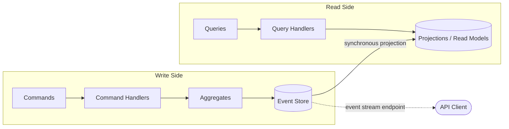

# CQRS/Event Sourcing — Hand-Rolled (No Framework)

Banking domain (accounts + transfers) implemented with CQRS and Event Sourcing from scratch. No `@nestjs/cqrs`, no event sourcing library. NestJS + TypeScript + Drizzle + PostgreSQL + Vitest.

Part of a 7-architecture comparison series. Same domain, same API surface, same stack.

## Architecture Overview



**Write side**: Commands validate business rules, produce domain events, and append them to an append-only event store (a single `events` table). Aggregates are reconstituted by replaying their event history — there is no mutable state stored for the write model.

**Read side**: Projectors listen to domain events and maintain denormalized read model tables (`account_read_model`, `transfer_read_model`). Query handlers read exclusively from these projections — never from the event store.

**Key distinction from traditional CQRS**: The event store *is* the source of truth. The read models are derived and can be rebuilt at any time by replaying all events. The `AccountProjector` has an explicit `rebuild()` method that demonstrates this.

There is **no EventBus**. Command handlers call projectors directly after appending events to the store. This is the simplest possible approach — synchronous, in-process, no message broker.

## Project Structure

```
src/
├── commands/                          # Write side — command handlers
│   ├── create-account.handler.ts      # Creates account, appends AccountCreated event
│   └── initiate-transfer.handler.ts   # Orchestrates transfer: loads aggregates, appends events, updates projections
├── domain/
│   ├── aggregates/
│   │   └── account.ts                 # Account aggregate — create, debit, credit, reconstitute from events
│   ├── events/
│   │   ├── account-events.ts          # AccountCreated, AccountDebited, AccountCredited
│   │   └── transfer-events.ts         # TransferInitiated, TransferCompleted, TransferFailed
│   └── errors/
│       └── domain-errors.ts           # Typed domain errors (InsufficientFunds, ConcurrencyError, etc.)
├── projections/                       # Read side — projectors that build read models
│   ├── account.projector.ts           # Handles account events → updates account_read_model table; has rebuild()
│   └── transfer.projector.ts          # Writes completed/failed transfers to transfer_read_model table
├── queries/                           # Read side — query handlers
│   ├── get-account.handler.ts         # Reads from account_read_model by id
│   ├── get-account-events.handler.ts  # Reads raw events from the event store (event stream endpoint)
│   ├── get-transfer.handler.ts        # Reads from transfer_read_model by id
│   └── list-accounts.handler.ts       # Reads all rows from account_read_model
└── infrastructure/
    ├── app.module.ts                  # NestJS module wiring — all providers registered flat
    ├── main.ts                        # Bootstrap on port 3006
    ├── event-store/
    │   └── event-store.ts             # Append-only store: append(), appendMultiple(), loadEvents()
    ├── persistence/
    │   ├── database.ts                # Drizzle + pg Pool provider
    │   ├── schema.ts                  # Three tables: events, account_read_model, transfer_read_model
    │   └── migrations/                # Drizzle migration SQL files
    └── rest/
        ├── account.controller.ts      # POST /accounts, GET /accounts, GET /accounts/:id, GET /accounts/:id/events
        ├── transfer.controller.ts     # POST /transfers, GET /transfers/:id
        └── error-filter.ts            # Maps domain error names → HTTP status codes

test/
├── setup.ts                                      # DB connection, migrate, truncate between tests
├── unit/
│   └── account-aggregate.test.ts                  # Pure unit tests for Account aggregate
├── account-creation.integration.test.ts           # HTTP + DB: account creation, event store verification, concurrency
├── account-projections-queries.integration.test.ts # Read model correctness, CQRS split proof, projection rebuild
├── transfer-command.integration.test.ts           # Transfer flow, balances, failed transfers, atomicity
└── transfer-projections-events.integration.test.ts # Transfer read model, event stream endpoint, event ordering
```

## How It Works

### Write Path (Command → Event Store → Projection)

1. **Controller** receives HTTP request, delegates to a command handler
2. **Command handler** loads the aggregate's event history from the event store via `EventStore.loadEvents()`
3. **Aggregate** is reconstituted by replaying events through `Account.reconstitute(events)` — folding each event into immutable state
4. **Aggregate** executes the business operation (e.g., `account.debit(amount, transferId)`), which validates invariants and returns a new domain event (or throws)
5. **Command handler** appends the new event(s) to the event store via `EventStore.append()` with an expected version for optimistic concurrency
6. **Command handler** calls the projector(s) synchronously to update the read model

### Read Path (Query → Read Model)

1. **Controller** receives HTTP request, delegates to a query handler
2. **Query handler** reads directly from the projection table (`account_read_model` or `transfer_read_model`)
3. Returns a DTO — no aggregate loading, no event replay

### Event Stream (Special Case)

`GET /accounts/:id/events` reads directly from the event store — it is the one read endpoint that bypasses projections. This gives callers the full audit trail.

## Key Patterns

### Event Store (Append-Only)
Single `events` table with a unique constraint on `(aggregate_id, version)`. Events are never updated or deleted. The `EventStore` service provides `append()`, `appendMultiple()`, and `loadEvents()`. No generic framework — just SQL inserts and selects via Drizzle.

### Aggregate Reconstitution
`Account.reconstitute(events)` folds an array of domain events into an immutable `Account` instance. Each `apply()` call returns a new `Account` with updated state. The aggregate tracks its own `version` (count of applied events).

### Optimistic Concurrency
The `(aggregate_id, version)` unique constraint in PostgreSQL acts as the concurrency guard. If two writers try to append at the same expected version, one gets a `23505` unique violation, which the `EventStore` catches and rethrows as `ConcurrencyError` (mapped to HTTP 409).

### Projections
Projectors are plain NestJS `@Injectable()` classes that take a domain event and write to read model tables. `AccountProjector` handles all three account event types. `TransferProjector` has separate methods for completed vs. failed transfers. `AccountProjector.rebuild()` wipes the read model and replays all account events from the event store.

### CQRS Split
Command handlers use the event store + aggregates. Query handlers use the read model tables. The integration tests prove this by deleting read model rows and showing that GET returns 404 even though events still exist in the store.

### Batch Append
`EventStore.appendMultiple()` accepts multiple aggregate batches in a single insert. The transfer handler uses this to atomically append events across three aggregates (transfer + source account + destination account) in one database operation.

## Gotchas

**Projections are synchronous and in-process.** The command handler calls projectors directly after appending events. If the projection write fails, the events are already in the store but the read model is stale. There is no retry or outbox pattern. The `rebuild()` method is your escape hatch.

**No EventBus, no pub/sub.** Events flow from command handler → projector via direct method calls. Adding a new projector means editing the command handler. In a real system you would want an event bus or outbox to decouple this.

**Event deserialization is manual and unsafe.** `loadEvents()` returns `eventData` as `unknown`. The transfer handler casts it with `as Record<string, unknown>` and passes it into `Account.reconstitute()` with a type assertion. Projectors also cast `event.data` inline. There is no schema validation — if someone corrupts event data in the DB, you get runtime errors, not compile-time errors.

**No Transfer aggregate.** Transfers are modeled as a sequence of events (`TransferInitiated` → `TransferCompleted`/`TransferFailed`) but there is no `Transfer` aggregate class that reconstitutes from events. The transfer command handler orchestrates everything procedurally. The transfer read model is write-once (insert only), never updated.

**Balance is stored as `numeric` (string) in PostgreSQL, returned as `number` in the API.** Query handlers call `Number(row.balance)` to convert. The projectors use raw SQL arithmetic (`balance::numeric + amount`) for updates. Watch out for floating-point issues if you extend beyond integer amounts.

**`appendMultiple` is not truly transactional across aggregates.** It does a single `INSERT ... VALUES` with rows from all batches, which PostgreSQL executes atomically. But the unique constraint violation is caught generically — the error message joins all aggregate IDs, so you cannot tell which specific aggregate had the conflict.

**Failed transfers still return 201.** A transfer that fails due to insufficient funds is still "created" — it gets `TransferInitiated` + `TransferFailed` events, a read model row with status `FAILED`, and the response has HTTP 201 with `status: "FAILED"`. This is a design choice (transfer is a recorded fact), but it may surprise API consumers.

## Pros

- **Complete audit trail.** Every state change is a recorded event. You can reconstruct any aggregate's state at any point in time by replaying events up to that version.
- **Read model is rebuildable.** If projections get corrupted or you need a new view, replay events from the store. `AccountProjector.rebuild()` demonstrates this.
- **Optimistic concurrency is simple and effective.** A database unique constraint does the heavy lifting — no distributed locks, no CAS operations.
- **Write and read models scale independently.** Read models are denormalized for query performance. Write model is normalized (one table, append-only).
- **No framework magic.** Everything is explicit. You can trace the full flow from HTTP request → command handler → aggregate → event store → projector → read model → query handler → response without stepping through framework internals.
- **Aggregates are pure.** `Account` has no dependencies, no decorators, no database access. It takes events in, produces events out. Trivial to unit test.
- **Failed operations are first-class.** Failed transfers are recorded as events, not swallowed as exceptions. You have a complete record of what happened and why.

## Cons

- **More code for the same functionality.** Compared to a simple CRUD approach, you maintain event types, aggregates, projectors, read models, and query handlers — all for the same business operations.
- **Synchronous projections couple read and write.** A failing projector blocks the command response. No async event processing, no eventual consistency benefits.
- **No event versioning or upcasting.** If event schemas change over time, there is no migration strategy. Old events in the store must remain compatible with current projector/aggregate code.
- **Aggregate loading gets slower over time.** Every command replays the full event history for the aggregate. No snapshots. For a long-lived account with thousands of events, this becomes a performance bottleneck.
- **Read model consistency is fragile.** If the app crashes between `eventStore.append()` and `projector.project()`, the read model falls behind. The only recovery is manual rebuild.
- **No saga or process manager.** The transfer handler does everything in one synchronous flow. If the domain required multi-step, long-running processes with compensating actions, this design does not support it.
- **Manual wiring.** Adding a new event type requires touching the event type union, the aggregate's `apply()` switch, the projector's `project()` switch, and possibly the command handler. There is no convention or registration mechanism.
