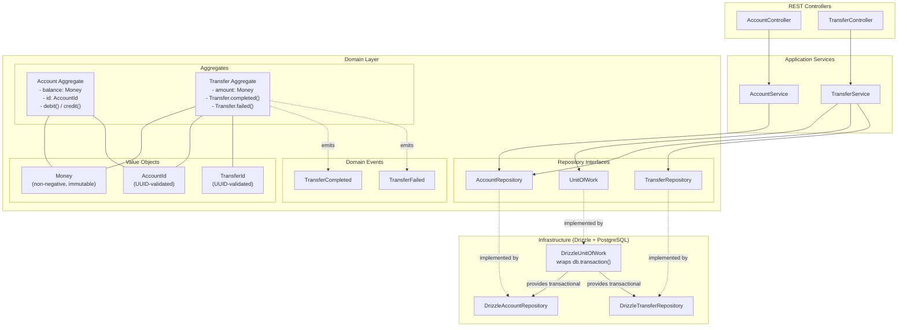

# DDD Tactical Patterns — Banking Service

One of 7 architecture comparison projects. Same banking domain (accounts + transfers), same REST API, NestJS + TypeScript + Drizzle + PostgreSQL + Vitest.

## Architecture Overview



DDD Tactical Patterns focus on modeling business logic in the domain layer using rich objects that enforce their own invariants. The key building blocks:

- **Aggregates** — Objects that group related data and enforce business rules. The `Account` aggregate rejects invalid debits itself rather than relying on the service layer to check balances. The `Transfer` aggregate uses static factory methods (`completed`, `failed`) to produce domain events on creation.
- **Value Objects** — Immutable types that replace primitives. `Money` prevents negative amounts, `AccountId`/`TransferId` enforce UUID format. You cannot construct an invalid one.
- **Domain Events** — Records of things that happened. `TransferCompleted` and `TransferFailed` are attached to the `Transfer` aggregate and persisted alongside it in a `domain_events` table.
- **Repository Interfaces** — Defined in the domain layer, implemented in infrastructure. The domain never knows about Drizzle or PostgreSQL.
- **Unit of Work** — Wraps a database transaction so debit + credit + transfer save happen atomically.

## Project Structure

```
src/
  domain/                          # Pure domain logic — zero framework imports
    aggregates/
      account.ts                   # Account aggregate — debit/credit with balance invariant
      transfer.ts                  # Transfer aggregate — static factories + domain events
    value-objects/
      money.ts                     # Non-negative amount, immutable arithmetic
      account-id.ts                # UUID-validated identity
      transfer-id.ts               # UUID-validated identity
    events/
      domain-event.ts              # Base event interface
      transfer-completed.ts        # Event produced on successful transfer
      transfer-failed.ts           # Event produced on failed transfer
    errors/
      domain-errors.ts             # Typed domain errors (InsufficientFunds, InvalidId, etc.)
    repositories/
      account-repository.interface.ts   # Interface — domain defines what it needs
      transfer-repository.interface.ts  # Interface
      unit-of-work.interface.ts         # Transaction abstraction
  application/                     # Orchestration — no business rules here
    account.service.ts             # Create/get/list accounts
    transfer.service.ts            # Validate, execute transfer inside UoW, handle failures
  infrastructure/                  # Framework + DB — implements domain interfaces
    app.module.ts                  # NestJS module — wires interfaces to Drizzle implementations
    main.ts                        # Bootstrap on port 3004
    persistence/drizzle/
      schema.ts                    # Drizzle table definitions (accounts, transfers, domain_events)
      account-repository.ts        # Implements AccountRepository with Drizzle
      transfer-repository.ts       # Implements TransferRepository, persists domain events
      unit-of-work.ts              # Wraps db.transaction(), provides transactional repos
      drizzle.provider.ts          # NestJS provider for Drizzle connection
      migrations/                  # SQL migration files
    rest/
      account.controller.ts        # POST/GET /accounts
      transfer.controller.ts       # POST/GET /transfers
      error-filter.ts              # Maps domain error names to HTTP status codes

test/
  in-memory-account-repository.ts  # In-memory implementation for unit tests
  in-memory-transfer-repository.ts
  in-memory-unit-of-work.ts        # No-op transaction wrapper for unit tests
  setup.ts                         # Integration test DB setup + migration
  unit/
    aggregates/                    # Test aggregate invariants directly
    value-objects/                 # Test Money, AccountId construction rules
    application/                   # Test services with in-memory repos
  integration/                     # Full HTTP + real DB tests
```

## How It's Used

### Aggregates enforce business rules

The `Account` constructor rejects empty owner names. `debit()` rejects overdrafts. The application service calls `sourceAccount.debit(money)` and does not check the balance itself — the aggregate is the authority.

```typescript
// account.ts — the aggregate protects its own invariant
debit(amount: Money): void {
  if (!this._balance.isGreaterThanOrEqual(amount)) {
    throw new InsufficientFundsError(this._id.value, this._balance.value, amount.value);
  }
  this._balance = this._balance.subtract(amount);
}
```

### Value objects for type safety

You cannot pass a raw string where an `AccountId` is expected, and you cannot create a `Money` with a negative number. Construction validates; the rest of the code trusts the type.

```typescript
// Money.create(-5) throws InvalidBalanceError
// AccountId.create("not-a-uuid") throws InvalidIdError
```

### Domain events for side effects

`Transfer` uses static factory methods instead of a public constructor. Each factory attaches the appropriate domain event. Events are stored in a `domain_events` table by the repository.

```typescript
const transfer = Transfer.completed(id, fromId, toId, money, timestamp);
transfer.domainEvents; // [{ type: 'TransferCompleted', data: {...}, timestamp }]
```

### Repository pattern

The domain defines interfaces (`AccountRepository`, `TransferRepository`). Infrastructure provides Drizzle implementations. Unit tests swap in `InMemoryAccountRepository` — no mocking frameworks needed.

### Unit of Work

`TransferService.executeTransfer()` runs inside `unitOfWork.execute()`, which wraps everything in a database transaction. The transactional repositories inside UoW use `SELECT ... FOR UPDATE` to prevent concurrent balance corruption.

## Key Patterns

| Pattern | Implementation | What It Does |
|---------|---------------|--------------|
| Aggregate | `Account`, `Transfer` | Enforce invariants, group related state |
| Value Object | `Money`, `AccountId`, `TransferId` | Immutable, self-validating types replacing primitives |
| Domain Event | `TransferCompleted`, `TransferFailed` | Record what happened, persisted in `domain_events` table |
| Repository | `AccountRepository` interface + `DrizzleAccountRepository` | Decouple domain from persistence |
| Unit of Work | `UnitOfWork` interface + `DrizzleUnitOfWork` | Atomic multi-aggregate operations via DB transactions |
| Factory Method | `Transfer.completed()`, `Transfer.failed()` | Controlled creation with event production |
| Reconstitution | `Transfer.reconstitute()` | Rebuild aggregate from DB without re-emitting events |
| Error Filter | `DomainErrorFilter` | Map domain error class names to HTTP status codes |

## Gotchas

1. **Account's constructor is public, Transfer's is private.** `Account` uses `new Account(...)` everywhere (including repositories), while `Transfer` forces you through static factories. This inconsistency means repositories reconstitute `Account` by calling its constructor directly, which re-runs the owner validation even on data coming from the DB.

2. **Value object unwrapping is manual and repetitive.** Every time you cross a boundary (service response, repository save, API response), you manually call `.value` on every value object. The `toAccountResponse()` and `toDomain()` functions are pure boilerplate.

3. **Domain events are not dispatched.** Events are persisted to the `domain_events` table but nothing reads or reacts to them. There is no event bus, no subscribers. They are effectively an audit log, not a side-effect mechanism.

4. **The in-memory UoW has no rollback.** `InMemoryUnitOfWork.execute()` just delegates to the same repositories — if the work function partially completes and then throws, the in-memory state is already mutated. Unit tests that rely on rollback behavior will not catch real bugs.

5. **Transfer service validates accounts exist twice.** `validateAccountsExist()` loads both accounts outside the transaction, then `executeTransfer()` loads them again inside the transaction. The first check is a quick-fail optimization but the second is the real one (with `FOR UPDATE` locking).

6. **`parseFloat` for money from DB.** The schema stores balance as `numeric(15,2)` (a string from Drizzle), and repositories use `parseFloat()` to convert back. This is fine for this scale but floating-point money is a classic footgun in production systems.

7. **The error filter matches on `error.name`, not `instanceof`.** `DomainErrorFilter` uses a `Map<string, number>` keyed by error name strings. If someone renames an error class without updating the map, it silently returns 500 instead of the correct status.

## Pros

- **Business rules are impossible to bypass.** The aggregate enforces invariants at the domain layer. No controller or service can skip the balance check — `debit()` is the only way to reduce a balance.
- **Unit tests need zero infrastructure.** Domain logic tests use no mocks, no containers, no databases. Swap in an `InMemoryAccountRepository` and test the actual domain.
- **Clear dependency direction.** Domain has no imports from application, infrastructure, or NestJS. The dependency arrow always points inward.
- **Domain events capture intent.** A `TransferFailed` event records *why* a transfer failed, not just that it returned an error.
- **Type safety catches bugs at construction.** You cannot accidentally pass a transfer ID where an account ID is expected — they are separate types even though both wrap strings.
- **Transactional integrity via Unit of Work.** The debit, credit, and transfer save all happen in one DB transaction with `SELECT FOR UPDATE`, preventing race conditions.

## Cons

- **Significant boilerplate for a simple domain.** Two aggregates, three value objects, two events, three repository interfaces, three implementations, a unit of work interface + implementation, transactional repository copies, and mapping functions in every layer. The n-tier version does the same thing in far fewer files.
- **Value objects add friction without much payoff at this scale.** `AccountId` validates a UUID and wraps a string. For a project with two entities, the cost of wrapping/unwrapping everywhere may exceed the value of catching a bad UUID early.
- **Repository implementations are duplicated inside Unit of Work.** `DrizzleUnitOfWork` contains full copies of `TransactionalAccountRepository` and `TransactionalTransferRepository` that largely duplicate `DrizzleAccountRepository` and `DrizzleTransferRepository`. Any schema change must be updated in both places.
- **Domain events are write-only.** Without an event bus or subscribers, the events add complexity (extra table, extra persistence code) without enabling the reactive patterns that make them valuable.
- **Aggregate boundaries are unclear.** `Account` has no reference to its transfers. The `Transfer` aggregate references account IDs but not account objects. The service orchestrates across both, which is correct DDD, but the boundaries feel artificial for this simple domain.
- **No domain services.** The transfer logic (debit source, credit destination) lives in the application service, not a domain service. In stricter DDD, cross-aggregate operations belong in a domain service, keeping the application layer as pure orchestration.

---

References
- [What is DDD - Eric Evans - DDD Europe 2019](https://www.youtube.com/watch?v=pMuiVlnGqjk)
- [Event Storming - Alberto Brandolini - DDD Europe 2019](https://www.youtube.com/watch?v=mLXQIYEwK24)
- [Bounded Contexts - Eric Evans - DDD Europe 2020](https://www.youtube.com/watch?v=am-HXycfalo)
- [Implementing Domain Driven Design with Spring by Maciej Walkowiak @ Spring I/O 2024](https://www.youtube.com/watch?v=VGhg6Tfxb60)
