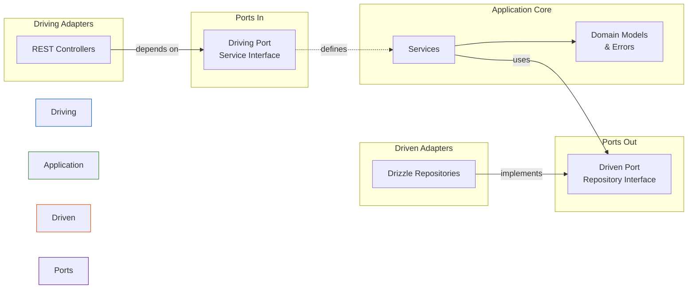

# Hexagonal Architecture (Ports & Adapters)

Banking domain (accounts + transfers) implemented with Hexagonal Architecture.
NestJS + TypeScript + Drizzle + PostgreSQL + Vitest.

One of 7 architecture comparison projects -- same domain, same API, different structure.

## Architecture Overview

Hexagonal Architecture organizes code around a central **application core** that knows nothing about the outside world. The core defines **ports** (interfaces) describing what it needs. **Adapters** implement those ports, connecting the core to real infrastructure.

Two kinds of adapters:
- **Driving adapters** (left side) -- push requests INTO the core. Here: REST controllers.
- **Driven adapters** (right side) -- the core pushes requests OUT to them. Here: database repositories.

The dependency rule: adapters depend on the core. The core depends on nothing external.



```
[HTTP Request]
     |
     v
 Driving Adapter          Application Core           Driven Adapter
 (REST Controller) -----> (Service) -----> (Port) <---- (Drizzle Repository)
                          uses domain       interface    implements interface
                          models/errors
```

## Project Structure

```
src/
  domain/                          # The hexagon's core -- no framework imports
    models/
      account.ts                   # Account interface + factory/validation functions
      transfer.ts                  # Transfer interface + factory functions
    errors/
      domain-errors.ts             # Domain-specific error classes
    ports/
      account-repository.port.ts   # Port interface + injection token
      transfer-repository.port.ts  # Port interface + injection token
      unit-of-work.port.ts         # Port interface + injection token

  application/                     # Use cases -- orchestrates domain, depends on ports
    account.service.ts             # Create/get accounts (injects AccountRepositoryPort)
    transfer.service.ts            # Execute/get transfers (injects all three ports)

  adapters/
    driving/
      rest/
        account.controller.ts      # HTTP -> AccountService
        transfer.controller.ts     # HTTP -> TransferService
        error-filter.ts            # Maps domain errors to HTTP status codes
    driven/
      persistence/drizzle/
        account-repository.adapter.ts   # Implements AccountRepositoryPort
        transfer-repository.adapter.ts  # Implements TransferRepositoryPort
        unit-of-work.adapter.ts         # Implements UnitOfWork (wraps DB transaction)
        schema.ts                       # Drizzle table definitions
        drizzle.provider.ts             # DB connection factory
        migrations/                     # SQL migrations

  infrastructure/
    app.module.ts                  # NestJS module -- wires ports to adapters
    main.ts                        # Bootstrap

test/
  in-memory-account-repository.ts  # In-memory adapter for AccountRepositoryPort
  in-memory-transfer-repository.ts # In-memory adapter for TransferRepositoryPort
  in-memory-unit-of-work.ts        # In-memory adapter for UnitOfWork
  setup.ts                         # DB connection + migration for integration tests
  accounts/
    account-creation.test.ts       # Domain tests (in-memory, no DB)
    account-retrieval.test.ts      # Domain tests (in-memory, no DB)
    accounts.integration.test.ts   # HTTP + real DB
  transfers/
    transfer-execution.test.ts     # Domain tests (in-memory, no DB)
    transfer-retrieval.test.ts     # Domain tests (in-memory, no DB)
    transfers.integration.test.ts  # HTTP + real DB
```

## How It's Used

### Dependency Inversion via Ports

Ports are TypeScript interfaces defined in `domain/ports/`. Each port file also exports a string token (e.g., `ACCOUNT_REPOSITORY = 'ACCOUNT_REPOSITORY'`) used for NestJS dependency injection.

Application services receive ports through constructor injection using `@Inject(TOKEN)`:

```typescript
@Injectable()
export class AccountService {
  constructor(
    @Inject(ACCOUNT_REPOSITORY)
    private readonly accountRepository: AccountRepositoryPort,
  ) {}
}
```

The service never knows whether it's talking to Postgres or an in-memory Map.

### Wiring in the Module

`app.module.ts` binds each port token to a concrete adapter class:

```typescript
{ provide: ACCOUNT_REPOSITORY, useClass: DrizzleAccountRepository },
{ provide: TRANSFER_REPOSITORY, useClass: DrizzleTransferRepository },
{ provide: UNIT_OF_WORK, useClass: DrizzleUnitOfWork },
```

Swapping to a different database means writing new adapters and changing these three lines.

### Driving vs Driven

**Driving adapters** (controllers) depend directly on application services -- no port interface needed because the controller is on the "outside" calling "in". The service IS the API of the core.

**Driven adapters** (repositories) implement port interfaces defined by the core. The core says "I need something that can `save(account)`" and the adapter fulfills that contract.

### Unit of Work

The `UnitOfWork` port wraps transactional operations. The Drizzle adapter uses `db.transaction()` and creates transactional repository instances inside the callback. The in-memory test adapter just passes through the same repositories (no real transaction semantics).

## Key Patterns

**Ports as interfaces with tokens** -- Each port is a TypeScript `interface` (not an abstract class). A companion `const` string token enables NestJS `@Inject()`. This keeps the domain free of framework decorators.

**Domain model as plain data + functions** -- `Account` and `Transfer` are interfaces (not classes). Factory functions (`createAccount`, `createCompletedTransfer`) handle validation and construction. No ORM decorators, no base classes.

**Domain errors** -- Each error is a named `Error` subclass. The driving adapter layer maps error names to HTTP status codes via a `Map<string, number>` in the error filter. Domain code throws; adapters translate.

**Adapter-level data mapping** -- Repository adapters have `toDomain()` methods that convert database rows (string balances from `numeric` columns) to domain objects (number balances). The domain never sees database types.

**In-memory test adapters** -- Tests create services with in-memory adapters directly, bypassing NestJS entirely. This proves the domain has zero framework coupling. The test file itself is the proof: if domain code imported infrastructure, the test would not compile.

## Gotchas

1. **Token strings, not symbols** -- Port tokens are `const` strings (`'ACCOUNT_REPOSITORY'`), while the Drizzle provider uses a `Symbol('DRIZZLE')`. Mixing these patterns can cause confusing DI errors. The Drizzle symbol is infrastructure-internal, so it never leaks into domain code, but the inconsistency is worth noting.

2. **UnitOfWork duplicates repository logic** -- `DrizzleUnitOfWork` contains full `TransactionalAccountRepository` and `TransactionalTransferRepository` classes that duplicate the mapping logic from the standalone repository adapters. Change one, forget the other.

3. **Domain models are interfaces, not classes** -- You cannot use `instanceof` checks on `Account` or `Transfer`. Validation lives in standalone functions, not in constructors. If someone adds a method to the interface, every adapter (including in-memory test ones) needs updating.

4. **No rollback in in-memory UnitOfWork** -- The test `InMemoryUnitOfWork` just delegates to the same repositories with no transaction isolation. If a test relies on rollback behavior on failure, it will not catch the bug. The `InsufficientFundsError` test works only because the error is thrown before any writes.

5. **Error filter catches everything** -- `DomainErrorFilter` uses `@Catch()` with no type argument, meaning it handles ALL exceptions. Unknown errors become 500s, which is fine, but it also swallows NestJS's built-in error handling (validation pipes, etc.). If you add NestJS validation later, you will need to carve out exceptions.

6. **Balance stored as `numeric`, used as `number`** -- Drizzle returns `numeric` columns as strings. Adapters `parseFloat()` them back. This works for the banking amounts here but will silently lose precision on very large numbers. The domain has no concept of this mismatch.

## Pros

- **Testable without infrastructure** -- Domain and application tests run with in-memory adapters. No database, no framework bootstrap, sub-second execution.
- **Swappable infrastructure** -- Replacing Drizzle/Postgres with another ORM or database requires only new driven adapters and a module rebind. Core logic untouched.
- **Clear dependency direction** -- All arrows point inward. The domain folder has zero imports from `adapters/`, `infrastructure/`, or `@nestjs/*`.
- **Explicit contracts** -- Ports make the domain's requirements visible. You can read the three port files and know exactly what infrastructure the application needs.
- **Framework at the edges** -- NestJS decorators only appear in adapters and the module. The domain and application layers are framework-agnostic TypeScript.

## Cons

- **Adapter duplication** -- The UnitOfWork adapter duplicates all repository mapping logic. In a real project with 10+ entities, this becomes a maintenance burden.
- **Boilerplate** -- Every domain concept needs: port interface, port token, adapter class, and potentially a transactional adapter variant. For a small CRUD app, this is overhead.
- **Indirection cost** -- Following a request from controller to service to port to adapter requires jumping through multiple files. The port interface is one more hop that doesn't exist in simpler architectures.
- **Testing gap around transactions** -- The in-memory UnitOfWork does not actually simulate transactional behavior. You need integration tests to catch transaction-related bugs.
- **No input validation at the API boundary** -- Controllers pass raw request bodies straight to services. There are no DTOs, no NestJS validation pipes. Validation happens in domain functions, which is architecturally pure but means malformed requests travel deeper into the stack before failing.
- **Infrastructure folder is thin** -- `infrastructure/` only holds `app.module.ts` and `main.ts`. The Drizzle provider and schema live inside `adapters/driven/`. Whether the DB connection factory is "adapter" or "infrastructure" is debatable -- different hexagonal implementations place it differently.
