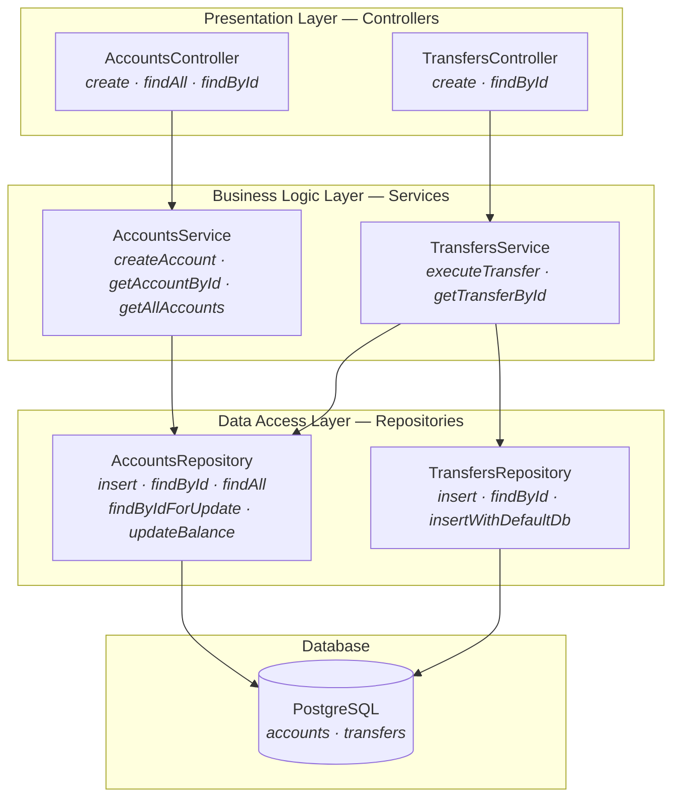

# N-Tier Architecture

## Architecture Overview

N-tier (also called layered architecture) organizes code into horizontal layers, each with a single responsibility. Requests flow top-down through the layers; each layer only talks to the one directly below it.



```
┌─────────────────────────────┐
│    Presentation Layer       │  Controllers — HTTP in/out
├─────────────────────────────┤
│    Business Logic Layer     │  Services — validation, rules, orchestration
├─────────────────────────────┤
│    Data Access Layer        │  Repositories — DB queries
├─────────────────────────────┤
│    Database                 │  PostgreSQL (via Drizzle)
└─────────────────────────────┘
```

Dependencies point **downward only**. Controllers depend on services, services depend on repositories, repositories depend on the database. Nothing points up.

## Project Structure

```
src/
├── main.ts                          # NestJS bootstrap
├── app.module.ts                    # Root module — wires Database, Accounts, Transfers
├── accounts/
│   ├── accounts.module.ts           # NestJS module — registers controller, service, repository
│   ├── accounts.controller.ts       # HTTP endpoints: POST /accounts, GET /accounts, GET /accounts/:id
│   ├── accounts.service.ts          # Business logic: validation, UUID generation, type conversion
│   └── accounts.repository.ts       # Data access: insert, findById, findAll, findByIdForUpdate, updateBalance
├── transfers/
│   ├── transfers.module.ts          # NestJS module — imports AccountsModule for cross-module access
│   ├── transfers.controller.ts      # HTTP endpoints: POST /transfers, GET /transfers/:id
│   ├── transfers.service.ts         # Business logic: transfer orchestration, DB transactions, insufficient-funds handling
│   └── transfers.repository.ts      # Data access: insert (within tx), findById, insertWithDefaultDb
└── database/
    ├── database.module.ts           # Global module — exports Drizzle provider
    ├── drizzle.provider.ts          # Factory — creates Drizzle instance from pg Pool
    ├── schema.ts                    # Drizzle table definitions: accounts, transfers
    └── migrations/                  # SQL migrations generated by drizzle-kit

test/
├── setup.ts                         # Shared test infra — migration runner, table truncation, DB connection
├── accounts/
│   ├── account-creation.test.ts     # Service-level tests for account creation rules
│   ├── account-retrieval.test.ts    # Service-level tests for lookup and listing
│   └── accounts.integration.test.ts # HTTP-level tests via supertest (full NestJS app)
└── transfers/
    ├── transfer-execution.test.ts   # Service-level tests for transfers, atomicity, insufficient funds
    ├── transfer-retrieval.test.ts   # Service-level tests for transfer lookup
    └── transfers.integration.test.ts# HTTP-level tests via supertest
```

## How It's Used

**Request flow:** HTTP request hits the controller, which delegates to the service, which calls the repository, which queries the database.

```
POST /transfers
  → TransfersController.create()
    → TransfersService.executeTransfer()
      → AccountsRepository.findById()           // check accounts exist
      → db.transaction()
        → AccountsRepository.findByIdForUpdate() // lock rows
        → AccountsRepository.updateBalance()     // debit source
        → AccountsRepository.updateBalance()     // credit destination
        → TransfersRepository.insert()           // record transfer
```

**Cross-module dependency:** TransfersModule imports AccountsModule, so TransfersService can inject AccountsRepository directly. The service also injects the Drizzle DB instance to manage transactions.

**Wiring:** NestJS modules handle DI. DatabaseModule is `@Global()` so every module gets the Drizzle provider without importing it. Each feature module registers its own controller, service, and repository.

## Key Patterns

- **Repository pattern** — Repositories encapsulate all SQL/Drizzle queries. Services never touch the ORM directly (except for `db.transaction()` in TransfersService).
- **Service layer** — All business rules (validation, balance checks, transfer orchestration) live in services. Controllers are thin.
- **Manual type mapping** — Services define their own domain interfaces (`Account`, `Transfer`) and map from DB rows (where `balance` is `string` from `numeric`) to domain objects (where `balance` is `number`). The `toAccount()`/`toTransfer()` private methods handle this.
- **Transaction management in the service** — TransfersService owns the DB transaction, passing the `tx` handle down to repository methods that accept it as a parameter (`findByIdForUpdate(tx, id)`, `insert(tx, data)`).
- **SELECT ... FOR UPDATE** — Used for pessimistic locking during transfers to prevent race conditions. Implemented as raw SQL in the repository.
- **FAILED transfer records** — When a transfer fails due to insufficient funds, the transaction rolls back (balances unchanged) but a separate write outside the transaction records the FAILED transfer.

## Gotchas

1. **Balance is `string` in the DB, `number` in the domain.** Drizzle returns `numeric` columns as strings. Every service method must `parseFloat()` when reading and `.toFixed(2)` when writing. Miss one conversion and you get string concatenation instead of addition.

2. **TransfersService reaches into AccountsRepository directly.** It does not go through AccountsService. This means balance-update logic bypasses any validation the accounts service might add later. The layering is controller-service-repository, but cross-cutting concerns break the neat vertical slices.

3. **Transaction handle passed as a method argument.** Repository methods like `findByIdForUpdate(tx, id)` take a `tx` parameter while `findById(id)` uses the default DB. Two different calling conventions for the same repository. Easy to call the wrong one inside a transaction.

4. **TransfersRepository has two insert methods.** `insert(tx, data)` for transactional writes and `insertWithDefaultDb(data)` for recording FAILED transfers outside the rolled-back transaction. Non-obvious naming.

5. **No DTOs or validation pipe.** Controllers accept raw `@Body()` objects with inline type annotations. No class-validator, no transformation layer. All validation is hand-rolled in services.

6. **The Drizzle provider uses a `Symbol` token (`DRIZZLE`).** Tests must override this specific symbol with `overrideProvider(DRIZZLE).useValue(db)`. If you forget, you get the production connection string.

7. **UUID validation is duplicated.** Both `AccountsService` and `TransfersService` have their own `validateUuid()` private method with identical regex.

## Pros

- **Easy to understand.** The top-down flow is obvious. New developers can trace any request from controller to database in seconds.
- **Low ceremony.** Four files per feature (module, controller, service, repository). No abstractions for the sake of abstractions.
- **NestJS alignment.** This is the architecture NestJS was designed for. Modules, injectable services, and controllers map 1:1 to the layers. DI just works.
- **Fast to scaffold.** Adding a new feature means creating a module with the same four files. Copy-paste friendly.
- **Testable at two levels.** Service tests (inject real DB, skip HTTP) and integration tests (full app with supertest) coexist naturally.

## Cons

- **Business logic is coupled to the framework.** Services throw NestJS exceptions (`BadRequestException`, `NotFoundException`). If you moved the service to a different framework or a CLI, you would drag NestJS with it.
- **No domain model.** There is no `Account` or `Transfer` class with behavior. The `Account` interface is just a data shape. Business rules (validation, balance checks) live as procedural code in the service, not as methods on a domain object.
- **Cross-module coupling.** TransfersService depends on AccountsRepository (not AccountsService). The module boundary exists in NestJS wiring but is porous in practice. Changes to the accounts table or repository ripple into transfers.
- **No abstraction over persistence.** Services depend on concrete repository classes, not interfaces. Swapping Drizzle for another ORM means touching repositories and hoping services still work.
- **Shared mutable state concerns.** The `string`-to-`number` balance conversion is a leaky abstraction. The data access layer leaks its types (Drizzle's `numeric` as `string`) into the business layer, forcing every service to handle the conversion.
- **Transaction management is awkward.** The service must know about the Drizzle transaction API and pass `tx` handles to repositories. This is infrastructure concern bleeding into business logic.
