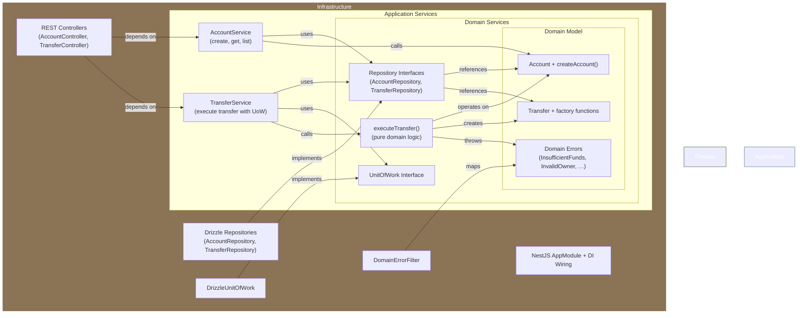

# Onion Architecture -- Banking API

NestJS + TypeScript + Drizzle + PostgreSQL + Vitest.
Same banking domain (accounts + transfers) and API surface as the other six comparison projects.

## Architecture Overview

Onion Architecture organizes code in concentric layers where dependencies point **inward only**. The innermost layer is the domain model (pure business logic, zero dependencies), and each outer layer may depend on anything inside it but never on anything outside it.



```
 Infrastructure (REST controllers, Drizzle repos, NestJS module)
   Application (use-case orchestration -- AccountService, TransferService)
     Domain Services (cross-aggregate logic, repository interfaces)
       Domain Model (Account, Transfer, domain errors)
```

The key idea: the domain core owns the **interfaces** that outer layers implement. Infrastructure depends on the domain, not the other way around.

## Project Structure

```
src/
  domain/
    model/
      account.ts            # Account interface + createAccount factory with validation
      transfer.ts           # Transfer interface + factory functions (completed/failed)
      errors.ts             # Domain error classes (InsufficientFunds, InvalidOwner, etc.)
    services/
      account-repository.interface.ts   # Repository contract -- defined in domain, implemented in infra
      transfer-repository.interface.ts  # Same pattern for transfers
      unit-of-work.interface.ts         # Transaction abstraction -- domain defines it, infra implements it
      transfer-domain.service.ts        # Pure function: executeTransfer (debit/credit/create transfer record)

  application/
    account.service.ts      # Use cases: create account, get by id, list all
    transfer.service.ts     # Use cases: execute transfer (with UoW), get transfer by id

  infrastructure/
    main.ts                 # NestJS bootstrap
    app.module.ts           # DI wiring -- binds interfaces to Drizzle implementations
    rest/
      account.controller.ts   # HTTP endpoints for /accounts
      transfer.controller.ts  # HTTP endpoints for /transfers
      error-filter.ts         # Maps domain errors to HTTP status codes
    persistence/drizzle/
      schema.ts               # Drizzle table definitions
      drizzle.provider.ts     # DB connection factory
      account-repository.ts   # Implements AccountRepository with Drizzle
      transfer-repository.ts  # Implements TransferRepository with Drizzle
      unit-of-work.ts         # Implements UnitOfWork using Drizzle transactions
      migrations/             # SQL migrations

test/
  domain/
    account-model.test.ts              # Pure unit tests for account factory
    transfer-domain-service.test.ts    # Pure unit tests for executeTransfer
  application/
    account-creation.test.ts           # Application service tests with in-memory repos
    account-retrieval.test.ts
    transfer-execution.test.ts
    transfer-retrieval.test.ts
  integration/
    accounts.integration.test.ts       # Full HTTP tests against real DB
    transfers.integration.test.ts
  in-memory-account-repository.ts      # Test doubles implementing domain interfaces
  in-memory-transfer-repository.ts
  in-memory-unit-of-work.ts
  setup.ts                             # DB migration + table truncation for integration tests
```

## How It's Used

**Dependency rule: inward only.**

- `domain/model/` has zero imports from outside itself. Pure TypeScript, no framework annotations, no I/O.
- `domain/services/` defines interfaces (`AccountRepository`, `TransferRepository`, `UnitOfWork`) and contains pure domain logic (`executeTransfer`). It imports only from `domain/model/`.
- `application/` imports from `domain/` only. It receives repository implementations via constructor injection (NestJS DI tokens like `ACCOUNT_REPOSITORY`). It never references Drizzle, HTTP, or any framework type.
- `infrastructure/` imports from everything. It implements the domain interfaces, wires DI, handles HTTP, and owns the database schema.

**Request flow:**

```
HTTP Request
  -> AccountController (infrastructure/rest)
    -> AccountService (application)
      -> createAccount() (domain/model)
      -> AccountRepository.save() (domain interface, infra implementation)
  <- HTTP Response (error-filter maps domain errors to status codes)
```

**Transfer flow with UnitOfWork:**

```
TransferService.executeTransfer()
  1. Validates amount + UUIDs (application layer)
  2. Verifies both accounts exist (via AccountRepository)
  3. Calls unitOfWork.execute() which wraps everything in a DB transaction:
     a. Re-fetches accounts with SELECT FOR UPDATE (infra detail)
     b. Calls domain executeTransfer() -- pure business logic
     c. Persists updated balances + transfer record
  4. On InsufficientFundsError: saves a FAILED transfer record outside the transaction
```

## Key Patterns

**Domain model as plain interfaces + factory functions.** No classes with methods. `Account` is an interface, `createAccount()` is a standalone function that validates and returns a frozen shape. This keeps the model serializable and trivially testable.

**Repository interfaces in the domain layer.** `AccountRepository` and `TransferRepository` are defined in `domain/services/`, not in infrastructure. The domain dictates what persistence operations it needs; infrastructure decides how.

**Domain services as pure functions.** `executeTransfer()` takes two accounts and an amount, returns new account states plus a transfer record. No I/O, no side effects, no injected dependencies. It throws `InsufficientFundsError` if the balance is too low.

**UnitOfWork pattern.** The `UnitOfWork` interface lives in the domain. It receives a callback that gets transactional repository instances. The Drizzle implementation (`DrizzleUnitOfWork`) wraps the callback in `db.transaction()` and provides transactional repositories that use `SELECT FOR UPDATE` for isolation.

**DI token constants.** Each interface has a companion string/symbol constant (`ACCOUNT_REPOSITORY`, `UNIT_OF_WORK`, etc.) used as NestJS injection tokens. The `AppModule` binds them to concrete implementations.

**Error filter for HTTP mapping.** `DomainErrorFilter` uses a static map of error class names to HTTP status codes. Domain errors never contain HTTP concepts. The infrastructure translates them.

## Gotchas

**Duplicated repository code in UnitOfWork.** `DrizzleUnitOfWork` contains full `TransactionalAccountRepository` and `TransactionalTransferRepository` classes that duplicate most of the logic from `DrizzleAccountRepository` and `DrizzleTransferRepository`. The transactional versions operate on a `tx` instead of `db`, and they add `SELECT FOR UPDATE`, but the mapping logic is copy-pasted. Changing a column mapping means updating it in two places.

**UUID validation lives in the application layer, not the domain.** `validateUuid()` is duplicated in both `AccountService` and `TransferService` as a private module-level function. It is not part of the domain model. If you add a third service, you copy it again.

**Domain model uses plain interfaces, not classes.** There are no rich entity methods like `account.debit(amount)`. Balance changes happen by creating new object spreads in `executeTransfer()`. This is a deliberate choice (functional style), but it means the Account type cannot enforce its own invariants after creation -- anyone can construct an `Account` object with invalid state by hand.

**Error filter matches on `exception.name` strings.** If you rename an error class or add a new one, you must also update the `DOMAIN_ERROR_STATUS_MAP` in the error filter. There is no compile-time check linking them.

**The `InMemoryUnitOfWork` test double does not actually roll back.** It just delegates to the same in-memory repos. This means application-layer tests for transfers do not verify atomicity -- that is only tested at the integration level.

**`balance` is stored as `numeric` in Postgres but as `number` in the domain.** The Drizzle schema uses `numeric(15,2)` (string in JS), and repos do `parseFloat()` / `.toString()` conversions. Floating-point precision loss is possible for very large amounts, though the `numeric` column itself is exact.

## Pros

- **Domain is completely isolated.** Zero framework imports in `domain/`. You can test all business rules with plain function calls -- no mocking frameworks, no DI containers, no async. The domain tests are the fastest and simplest in the project.
- **Swappable infrastructure.** Replacing Drizzle with another ORM or replacing REST with GraphQL requires zero changes to domain or application code. You just write new implementations of the same interfaces.
- **Testability at every layer.** Domain tests use plain functions. Application tests use in-memory implementations of domain interfaces. Integration tests hit the real stack. Each layer can be tested in isolation.
- **Clear dependency direction.** Import paths make violations obvious: if `domain/` imports from `infrastructure/`, something is wrong. Easy to enforce with lint rules.
- **Transaction logic is abstracted.** Application code calls `unitOfWork.execute()` without knowing about Drizzle transactions, connection pooling, or `SELECT FOR UPDATE`. The domain defines *what* should be atomic; infrastructure decides *how*.

## Cons

- **More files and indirection than simpler architectures.** A single "create account" operation touches the controller, application service, domain factory function, repository interface, and repository implementation. Five files minimum.
- **Repository interface duplication.** The UnitOfWork needs its own transactional repository implementations, leading to duplicated mapping/persistence code.
- **Interfaces can drift from implementations.** TypeScript structural typing helps, but the domain interfaces are just shapes. There is no runtime contract enforcement. A repository implementation could silently ignore part of the contract.
- **Overhead is hard to justify for simple CRUD.** The Account use cases (create, get, list) are thin pass-throughs. The architecture adds layers that do not carry their weight until business logic gets complex -- the Transfer use case is where it starts to pay off.
- **NestJS DI ceremony.** Token constants, `@Inject()` decorators, `useClass` bindings in the module -- this is boilerplate that simpler architectures avoid entirely. The indirection between token and implementation is invisible at call sites.
- **No enforced architectural boundary.** Nothing stops someone from importing Drizzle in `application/`. The layers are a convention, not a compiler-enforced constraint. Requires discipline or custom lint rules.
